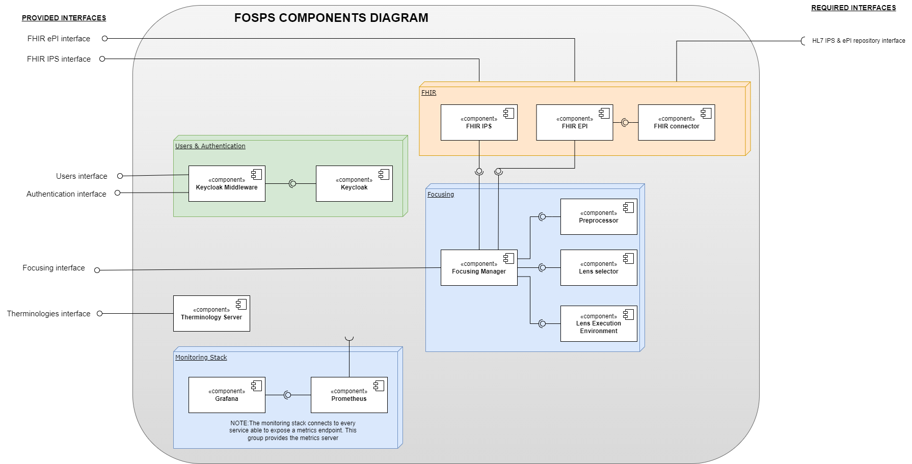

# FOSPS Services and APIs Documentation

This guide will explain each service and the communication between them. FOSPS has been developed following a microservices approach, and so, each service is responsible for different actions. We can categorize services in fosps like this:

# Table of contents

- [FOSPS Services and APIs Documentation](#fosps-services-and-apis-documentation)
- [Table of contents](#table-of-contents)
- [List of services/APIs](#list-of-servicesapis)
  - [Core Services](#core-services)
    - [Keycloak](#keycloak)
    - [Keycloak Registration/Middleware](#keycloak-registrationmiddleware)
    - [Authorization Middleware](#authorization-middleware)
  - [FHIR services](#fhir-services)
    - [FHIR server](#fhir-server)
    - [FHIR Connector](#fhir-connector)
    - [Terminology Server](#terminology-server)
  - [Focusing services](#focusing-services)
    - [Focusing manager (Coupled LEE)](#focusing-manager-coupled-lee)
    - [Preprocessors](#preprocessors)
    - [Lenses selectors](#lenses-selectors)
  - [Content Trust](#content-trust)
  - [Other:](#other)
    - [SwaggerUI](#swaggerui)
  - [Infrastructure services](#infrastructure-services)
    - [Istio](#istio)
    - [Monitor](#monitor)
    - [Github Actions](#github-actions)
  - [Glossary](#glossary)

# List of services/APIs

## Core Services

The services in this section are the main services that enable FOSPS to work as expected. Things like user management, authentication, and authorization are part of this list.

### Keycloak

[Keycloak](https://www.keycloak.org) is an open-source identity and access management (IAM) system developed by Red Hat. It is used for securing and managing user identities, authentication, authorization, and user account management in web and mobile applications.

Keycloak is used in fosps for:
    - Identity and access management (IAM)
    - Authentication with OpenID Connect (OIDC)
    - RBAC - Role Based Access Control (WIP)

Keycloak is the system that enables users registration, log-in, authentication and roles separation.

### Keycloak Registration/Middleware

[Keycloak registration](https://github.com/Gravitate-Health/keycloak-registration) is a custom development by UPM, which serves as interface between the clients and the [Keycloak Admin REST API](https://www.keycloak.org/docs-api/22.0.1/rest-api/index.html). The purpose of this middleware is to block access to the Admin API from the internet, and expose a limited interface with only the neccesary operations. 

These are the operations enabled by this service:
- User registration (With verification email)
- Login
- Password reset/forgotten
- Get/Edit/Delete user

This service reduces the attack surface for the IAM server, as operations are very limited and controlled. Further Admin operations can be made via the Web interface with an admin account, always having the required permissions.

[Swagger UI for Keycloak Registration](https://fosps.gravitatehealth.eu/swagger-fosps/#/)

### Authorization Middleware

Note: This service is under development.

Authorization in FOSPS is distributed Between Istio, Keycloak and this service. An [authorization middleware](https://github.com/Gravitate-Health/authorization-middleware) is used to control and manage access to specific resources, features, or functionalities based on user permissions and roles. It acts as a gatekeeper between users or clients and the protected resources, ensuring that only authorized individuals or entities are allowed to perform certain actions or access particular data.

Specifically, this service protects resources from FHIR servers (ePI & IPS), ensuring that a patient can only access to their own resources, and also, that practitioners can access to necessary data from their patients.

## FHIR services

These services go from FHIR servers, to other services that relate to FHIR resources and health.

### FHIR server

A [FHIR](https://www.hl7.org/fhir/) (Fast Healthcare Interoperability Resources) server is a specialized software application or component designed to store, manage, and exchange healthcare data in compliance with the FHIR standard. FHIR is a standard for healthcare data exchange developed by HL7 (Health Level Seven International), and it provides a standardized way to represent and share healthcare information electronically.

For Gravitate-Health, there are two FHIR servers working simultaneously, as there are two Implementation Guides which require different releases. Also, there is a fork for each one in the Gravitate-Health Github organization, including the deployment and sepcific configurations:
- [Gravitate Health IPS](https://github.com/hl7-eu/gravitate-health-ips) (R5). Repository available [here](https://github.com/Gravitate-Health/hapi-fhir-jpaserver-starter-ips).
- [Gravitate Health ePI](https://github.com/hl7-eu/gravitate-health) (R4) Repository available [here](https://github.com/Gravitate-Health/hapi-fhir-jpaserver-starter-epi).

FHIR servers are the store for patient and medicine information, which is the source of knowledge for the focusing mechanism.

[FHIR ePI Swagger UI](https://fosps.gravitatehealth.eu/epi/api/fhir/swagger-ui/)
[FHIR IPS Swagger UI](https://fosps.gravitatehealth.eu/ips/api/fhir/swagger-ui/)

### FHIR Connector

[FHIR Connector](https://github.com/Gravitate-Health/hapi-fhir-jpaserver-starter-ips) reads information from trusted sources, and replicates the data to the FHIR servers. Current sources are from the Implementation Guides developed for Gravitate-Health:

- [Gravitate Health ePI](https://github.com/hl7-eu/gravitate-health) - Source of patients ePIs.
- [Gravitate Health IPS](https://github.com/hl7-eu/gravitate-health-ips) - Source of medications, ingredients, organizations, etc.

This service periodically check the sources to upload new or updated data to FOSPS. 

### Terminology Server

The [terminology server](https://github.com/Gravitate-Health/terminology-service) offer a simple access to the standard terminologies used. Currently, ICPC-2 and SNOMED terminologies are being used.

[Swagger UI link](https://fosps.gravitatehealth.eu/swagger-fosps/?urls.primaryName=Terminology%20Service)

## Focusing services

Focusing services gather all services related to focusing: preprocessing, semantic annotating ePIs, enhancing and focusing ePIs based on IPS data.

### Focusing manager (Coupled LEE)

[Focusing manager]((https://fosps.gravitatehealth.eu/swagger-fosps/?urls.primaryName=Focusing%20Manager)) is the main piece in the whole focusing oprations. It is the core and the nexus for all the focusing services. Focusing manager provides the interface for the clients, as well as communicates with preprocessors, lenses and FHIR servers to get the necessary resources.

Focusing manager enables the following operations:
- Get all available preprocessors
- Get all available lenses
- Preprocess an ePI
- Focus an ePI based on an IPS
- Executes LEE

The LEE (Lens Execution Environment) is currently coupled into the Focusing Manager. The environment is executed in the focusing manager itself.

[Focusing Swagger UI](https://fosps.gravitatehealth.eu/swagger-fosps/?urls.primaryName=Focusing%20Manager)

### Preprocessors

Preprocessors read raw ePIs and add semantic annotations to their leaflets (automatically or by manual matching to preprocessed ePIs). These services read the ePI leaflet sections and add annotations based on text content. The output from preprocessors is used by lenses to know what content is inside each leaflet section, paragraph or sentence.

Currently there are two preprocessors:
- [Manual preprocessor](https://github.com/Gravitate-Health/preprocessing-service-manual). When it receives a raw ePI, returns the manually preprocessed ePI from the [HL7-Gravitate Health ePI repo](https://github.com/hl7-eu/gravitate-health).
- [Automatic Preprocessor](https://github.com/Gravitate-Health/preprocessing-service-mvp2)

### Lenses selectors

Lenses selector host and return lenses. Lenses are pieces of structured code (following a defined standard), which receive as input a preprocessed ePI and an IPS, and focus the ePI leaflet based on patient data like gender, age, health conditions, medications, allergies, intolerances, etc. 

List of available lenses, categorized by selector:
- Lens selector MVP2:
  - Pregnancy Lens
  - Diabetes Lens
  - VIH lens

Lenses consists in a javascript module which must export an object with two properties: `enhance` and `getSpecification`, which are functions that enhance an ePI and return the name and version lens, respectively. LEE in [focusing manager](#focusing-manager-coupled-lee) is responsible for executing this code in the expected way, and throw an error if the lens raised an error.

## Content Trust

[Work in Progress]

## Other:

### SwaggerUI

Simple [Swagger UI deployment](https://github.com/Gravitate-Health/swagger-deployment) to host all OpenAPI Specifications.

[Link](https://fosps.gravitatehealth.eu/swagger-fosps/) to the Swagger UI web.

## Infrastructure services

The services in this sections don't provide a direct functionality to FOSPS or to the Gravitate Health project, but they are equally necessary for the platform to work as expected. They provide transversal functionality to the whole FOSPS platform.

### Istio

[Istio](https://istio.io) Istio is an open-source service mesh platform that is designed to improve the management, security, and observability of microservices-based applications. Istio provides the communicating network interface for the containers hosting the services, letting and blocking the communication between services and internet based on defined rules, and also acts as a distributed API gateway inside the kubernetes cluster.

[Istio configuration and deployment details repository](https://github.com/Gravitate-Health/istio)

### Monitor

The [Grafana](https://grafana.com) + [Prometheus](https://prometheus.io) stack is a popular combination of two open-source tools often used for monitoring and observability in modern IT and DevOps environments. These tools, Grafana and Prometheus, work together to collect, store, visualize, and alert on metrics and data from various systems and applications.

In FOSPS, the stack is deployed to collect metrics and logs from the different services of the platform.

[Grafana + Prometheus deployment & config](https://github.com/Gravitate-Health/Monitor)

### Github Actions

All repositories with developments and/or deployments have Github Actions to enable DevSecOps operations. Automated pipelines to check vulnerabilities, leaked secrets, compile and deploy automatically new updates were develop to enable fast development and deployment, following an agile software development methodology.

Github Actions currently contain:
- Automatic semantic versioning & Git tagging
- Docker image build and push to GH registry
- Scurity scan with Trivi: Vulnerabilities (packages and OS), secrets and misconfigurations.

You can find the Github actions under the `.github/actions` folder in each repository.

## Glossary

- ePI: Electronic Product Information
- IPS: International Patient Summary
- LEE: Lens Execution Environment
- IAM: Identity and Access Management
- OIDC: OpenID Connect
- RBAC: Role Based Access Control
- GH: Gravitate Health
- IG: Implementation Guide